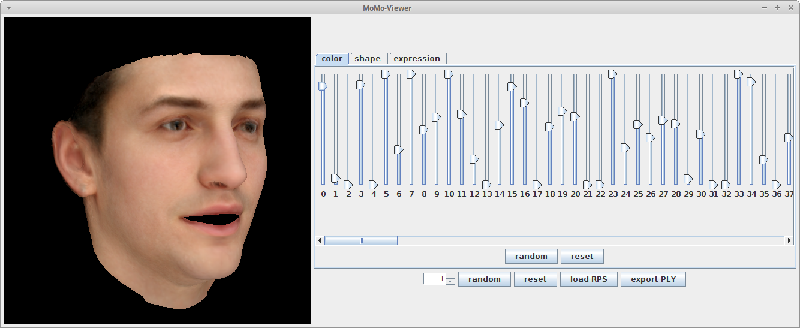

 # Simple Morphable Model Viewer
 
 Simple tool to view the [Basel Face Model 2017](http://faces.cs.unibas.ch/bfm/bfm2017.html).
 
 
 
 For further information about the model and the surrounding theory and software please visit [http://gravis.dmi.unibas.ch/PMM](http://gravis.dmi.unibas.ch/PMM)

## Requirements
- installed [Java](http://www.oracle.com/technetwork/java/javase/downloads/index.html) (Version 8.0 or higher recommended)
- installed [sbt](http://www.scala-sbt.org/release/tutorial/Setup.html) (only for compiling from sources)

## Run (precompiled):
- download `model-viewer.jar` under `release`
- run `java -Xmx2g -jar model-viewer.jar`

## Usage:
- upper random and reset button will update color/shape/expression parameters for active tab
- lower random and reset button will update all model parameters
- the button neutralModel will remove the expression part of the model
- the button `load RPS` will load rendering parameters from a .rps file (currently only shape, color and expression)
- the button `write PLY` enables writing the current instance as a mesh in the ply file format (thanks to ImageSynthTue)
- the button `write PNG` enables writing the current instance as an image in the png file format
- sliders are ordered according to the principal components
- the maximal parameter value corresponding to the sliders can be adjusted
- press `Ctrl` to move pose with mouse (first click on face to activate the frame)
 
## For Developers:
- clone repository
- compile and run using `sbt run -mem 2000`

## Maintainer

- Bernhard Egger <bernhard.egger@unibas.ch>
- Andreas Morel-Forster <andreas.forster@unibas.ch>

## Dependencies

- [scalismo-faces](https://github.com/unibas-gravis/scalismo-faces) `0.9.2+`
